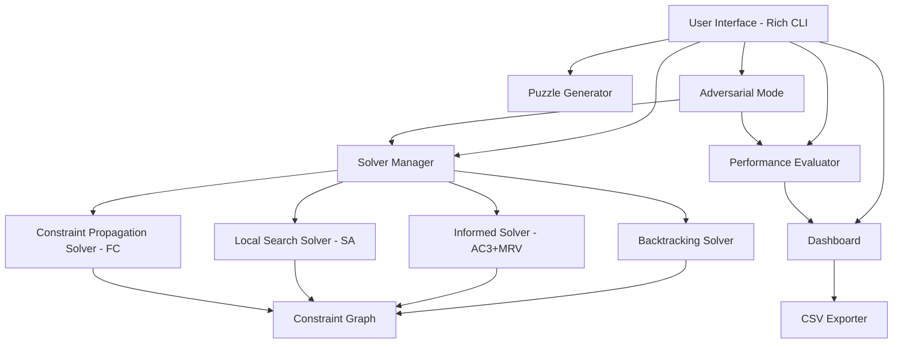
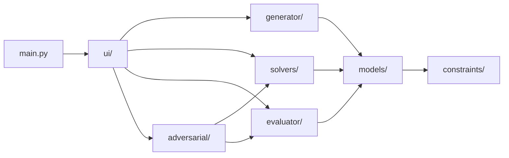

# Design Document

## Overview

This document describes the technical design for the AI-powered Multi-Level Sudoku Solver and Evaluator system. The system is a Python CLI application that generates Sudoku puzzles at four difficulty levels and solves them using four distinct AI search strategies. It provides performance evaluation, step-by-step visualization, adversarial racing mode, and CSV export capabilities.

The system is designed for a university CSC202 AI course to demonstrate CSP formulation, multiple search paradigms, and empirical performance analysis.

### Key Design Goals

- **Modularity**: Each component (generation, solving, evaluation, UI) is an independent module with well-defined interfaces
- **Extensibility**: New solvers can be added by implementing a common solver protocol
- **Observability**: All solvers emit step-by-step state transitions for visualization and metrics collection
- **Performance**: Solvers operate within configurable timeouts; adversarial mode uses threading for concurrency

## Architecture

### High-Level Architecture



### Module Dependency Graph



All dependencies flow downward — no circular imports. The `models` package defines shared data structures and abstract interfaces that all other modules depend on.

### Project Structure

```
sudoku_solver_evaluator/
├── main.py                     # Entry point
├── models/
│   ├── __init__.py
│   ├── grid.py                 # Grid, Cell data models
│   ├── enums.py                # DifficultyLevel, SolverType enums
│   ├── metrics.py              # SolveResult, PerformanceMetrics
│   └── protocols.py            # Abstract base classes / Protocols
├── constraints/
│   ├── __init__.py
│   └── validator.py            # Constraint checking utilities
├── generator/
│   ├── __init__.py
│   └── puzzle_generator.py     # Puzzle generation with difficulty control
├── solvers/
│   ├── __init__.py
│   ├── backtracking.py         # Backtracking Search (uninformed)
│   ├── informed.py             # AC-3 + MRV + Degree Heuristic
│   ├── simulated_annealing.py  # Simulated Annealing (local search)
│   └── forward_checking.py     # Constraint Propagation + Forward Checking
├── evaluator/
│   ├── __init__.py
│   ├── performance.py          # Performance recording and computation
│   └── exporter.py             # CSV export
├── adversarial/
│   ├── __init__.py
│   └── race.py                 # Adversarial mode with threading
├── ui/
│   ├── __init__.py
│   ├── cli.py                  # Main CLI menu and navigation
│   ├── display.py              # Grid display with Rich formatting
│   ├── dashboard.py            # Comparative analysis tables/charts
│   └── visualization.py        # Step-by-step visualization controller
├── tests/
│   ├── __init__.py
│   ├── test_grid.py
│   ├── test_constraints.py
│   ├── test_generator.py
│   ├── test_backtracking.py
│   ├── test_informed.py
│   ├── test_simulated_annealing.py
│   ├── test_forward_checking.py
│   ├── test_evaluator.py
│   └── test_properties.py     # Property-based tests
├── requirements.txt
└── README.md
```

## Components and Interfaces

### Core Protocols (Abstract Interfaces)

```python
from abc import ABC, abstractmethod
from typing import Optional, Generator
from models.grid import Grid
from models.metrics import SolveResult, StepEvent

class SolverProtocol(ABC):
    """Base interface for all Sudoku solvers."""
    
    @abstractmethod
    def solve(self, grid: Grid, timeout: float = 60.0) -> SolveResult:
        """
        Solve the given puzzle within the timeout.
        
        Args:
            grid: The initial puzzle grid (not mutated).
            timeout: Maximum wall-clock seconds allowed.
            
        Returns:
            SolveResult containing the solution (if found), metrics, and status.
        """
        ...
    
    @abstractmethod
    def solve_stepwise(self, grid: Grid, timeout: float = 60.0) -> Generator[StepEvent, None, SolveResult]:
        """
        Solve the puzzle yielding StepEvents for visualization.
        
        Yields:
            StepEvent for each state transition (assignment, backtrack, swap).
            
        Returns:
            SolveResult upon completion.
        """
        ...
    
    @property
    @abstractmethod
    def name(self) -> str:
        """Human-readable name of the solver."""
        ...


class PuzzleGeneratorProtocol(ABC):
    """Interface for puzzle generation."""
    
    @abstractmethod
    def generate(self, difficulty: 'DifficultyLevel', timeout: float = 30.0) -> Grid:
        """
        Generate a valid Sudoku puzzle with exactly one solution.
        
        Args:
            difficulty: The target difficulty level.
            timeout: Maximum generation time in seconds.
            
        Returns:
            A Grid with pre-filled cells appropriate for the difficulty.
            
        Raises:
            TimeoutError: If generation exceeds the timeout.
        """
        ...


class PerformanceEvaluatorProtocol(ABC):
    """Interface for performance recording and analysis."""
    
    @abstractmethod
    def record(self, result: SolveResult, puzzle_id: str, difficulty: 'DifficultyLevel') -> None:
        """Record a solve result for later analysis."""
        ...
    
    @abstractmethod
    def get_comparison(self, puzzle_id: str) -> 'ComparisonTable':
        """Get comparison data for all algorithms on a given puzzle."""
        ...
    
    @abstractmethod
    def get_aggregate(self, difficulty: 'DifficultyLevel') -> 'AggregateStats':
        """Get aggregate statistics for a difficulty level."""
        ...
    
    @abstractmethod
    def export_csv(self, filepath: str) -> None:
        """Export all recorded results to CSV."""
        ...
```

### Solver Manager

The `SolverManager` acts as a facade that routes solve requests to the appropriate solver implementation:

```python
class SolverManager:
    """Manages solver instances and dispatches solve requests."""
    
    def __init__(self):
        self._solvers: dict[SolverType, SolverProtocol] = {}
    
    def register(self, solver_type: SolverType, solver: SolverProtocol) -> None: ...
    def solve(self, grid: Grid, solver_type: SolverType, timeout: float = 60.0) -> SolveResult: ...
    def solve_all(self, grid: Grid, timeout: float = 60.0) -> dict[SolverType, SolveResult]: ...
    def solve_stepwise(self, grid: Grid, solver_type: SolverType, timeout: float = 60.0) -> Generator[StepEvent, None, SolveResult]: ...
```

### Adversarial Race Controller

```python
class RaceController:
    """Manages concurrent solver execution for adversarial mode."""
    
    def start_race(
        self, 
        grid: Grid, 
        solver_a: SolverType, 
        solver_b: SolverType, 
        timeout: float = 60.0
    ) -> RaceResult: ...
    
    def get_live_status(self) -> tuple[RaceStatus, RaceStatus]: ...
    def stop(self) -> None: ...
```

Uses `threading.Thread` for concurrent execution with shared `threading.Event` for cancellation signaling.

## Data Models

### Grid and Cell

```python
from dataclasses import dataclass, field
from typing import Optional
import copy

@dataclass
class Cell:
    """A single cell in the Sudoku grid."""
    row: int          # 0-8
    col: int          # 0-8
    value: Optional[int] = None   # 1-9 or None if empty
    is_fixed: bool = False        # True if pre-filled (not modifiable by solvers)
    domain: set[int] = field(default_factory=lambda: set(range(1, 10)))
    
    @property
    def box(self) -> int:
        """Returns the 3x3 box index (0-8) for this cell."""
        return (self.row // 3) * 3 + (self.col // 3)


@dataclass
class Grid:
    """9x9 Sudoku grid."""
    cells: list[list[Cell]]  # 9x9 matrix
    
    def get_cell(self, row: int, col: int) -> Cell: ...
    def set_value(self, row: int, col: int, value: int) -> None: ...
    def clear_value(self, row: int, col: int) -> None: ...
    def get_row(self, row: int) -> list[Cell]: ...
    def get_col(self, col: int) -> list[Cell]: ...
    def get_box(self, box_index: int) -> list[Cell]: ...
    def get_peers(self, row: int, col: int) -> list[Cell]: ...
    def get_empty_cells(self) -> list[Cell]: ...
    def is_complete(self) -> bool: ...
    def is_valid(self) -> bool: ...
    def copy(self) -> 'Grid': ...
    def count_filled(self) -> int: ...
    
    @classmethod
    def from_2d_list(cls, values: list[list[int]]) -> 'Grid':
        """Create a Grid from a 2D list where 0 represents empty cells."""
        ...
    
    def to_2d_list(self) -> list[list[int]]:
        """Export grid as 2D list (0 for empty cells)."""
        ...
```

### Enumerations

```python
from enum import Enum

class DifficultyLevel(Enum):
    EASY = "easy"
    MEDIUM = "medium"
    HARD = "hard"
    EXPERT = "expert"

class SolverType(Enum):
    BACKTRACKING = "backtracking"
    INFORMED = "informed"
    LOCAL_SEARCH = "local_search"
    FORWARD_CHECKING = "forward_checking"

class SolveStatus(Enum):
    SOLVED = "solved"
    UNSOLVABLE = "unsolvable"
    TIMEOUT = "timeout"
    FAILED = "failed"  # For SA when max restarts exhausted

class StepType(Enum):
    ASSIGN = "assign"       # Value assigned to a cell
    BACKTRACK = "backtrack"  # Assignment undone
    SWAP = "swap"           # Two cells swapped (SA)
    PROPAGATE = "propagate"  # Domain reduced via propagation
```

### Metrics and Results

```python
from dataclasses import dataclass, field
from typing import Optional

@dataclass
class SolveResult:
    """Result of a solve operation."""
    solver_type: SolverType
    status: SolveStatus
    solved_grid: Optional[Grid] = None
    time_ms: int = 0                  # Wall-clock time in milliseconds
    states_explored: int = 0
    backtracks: int = 0               # For backtracking-based solvers
    restarts: int = 0                 # For SA solver
    best_cost: Optional[int] = None   # For SA solver (lowest cost found)

@dataclass
class StepEvent:
    """A single step in the solving process for visualization."""
    step_type: StepType
    row: int
    col: int
    value: Optional[int] = None
    previous_value: Optional[int] = None
    # For swap events (SA)
    swap_row: Optional[int] = None
    swap_col: Optional[int] = None
    # Running metrics at this step
    states_explored: int = 0
    backtracks: int = 0
    current_cost: Optional[int] = None  # For SA

@dataclass
class ComparisonTable:
    """Comparison data for all algorithms on a single puzzle."""
    puzzle_id: str
    difficulty: DifficultyLevel
    results: dict[SolverType, SolveResult]
    rankings: dict[str, list[SolverType]]  # metric_name -> ranked solvers

@dataclass
class AggregateStats:
    """Aggregate statistics for a difficulty level."""
    difficulty: DifficultyLevel
    puzzle_count: int
    stats: dict[SolverType, 'AlgorithmStats']

@dataclass
class AlgorithmStats:
    """Mean/min/max for a single algorithm."""
    mean_time_ms: float
    min_time_ms: int
    max_time_ms: int
    mean_states: float
    min_states: int
    max_states: int
    mean_backtracks: float
    min_backtracks: int
    max_backtracks: int
    solve_rate: float  # Fraction of puzzles solved successfully

@dataclass
class RaceResult:
    """Result of an adversarial race."""
    solver_a_type: SolverType
    solver_b_type: SolverType
    solver_a_result: SolveResult
    solver_b_result: SolveResult
    winner: Optional[SolverType]  # None if tie
    time_difference_ms: int

@dataclass
class RaceStatus:
    """Live status of a solver during a race."""
    solver_type: SolverType
    states_explored: int
    elapsed_ms: int
    is_complete: bool
```

### Algorithm Design Details

#### Backtracking Solver

1. Validate initial grid for constraint violations (fail fast)
2. Traverse cells left-to-right, top-to-bottom, skipping fixed cells
3. For each empty cell, try values 1-9 sequentially
4. Check constraints (row, column, box uniqueness) after each assignment
5. If constraint violated, undo assignment (backtrack) and try next value
6. If all values exhausted, backtrack to previous cell
7. Increment `states_explored` on each assignment, `backtracks` on each undo

#### Informed Solver (AC-3 + MRV + Degree)

1. Initialize domains for all empty cells
2. Run AC-3 to enforce initial arc consistency
3. Select next variable using MRV (smallest domain), break ties with Degree Heuristic, then positional order
4. For each value in the selected cell's domain:
   a. Assign value, save domain state
   b. Run AC-3 on affected arcs
   c. If any domain becomes empty, restore and try next value
   d. Otherwise recurse
5. If no value works, backtrack

#### Simulated Annealing Solver

1. Initialize: fill each 3x3 box with random permutation of 1-9 (preserving fixed cells)
2. Compute initial cost (row + column duplicate count)
3. Loop until cost = 0 or temperature < threshold:
   a. Pick random box, pick two random non-fixed cells in that box
   b. Compute cost delta if swapped
   c. Accept if delta ≤ 0, else accept with probability e^(-delta/T)
   d. Cool: T = T × cooling_rate
4. If stuck (T < threshold), restart with new initialization (up to max_restarts)
5. Return best grid found across all restarts

#### Forward Checking Solver

1. Initialize domains, reduce by existing assignments
2. Apply Naked Singles and Hidden Singles propagation iteratively
3. Select next variable using MRV
4. For each value in domain:
   a. Assign value, save domain state
   b. Forward check: remove value from peers' domains
   c. Apply Naked Singles and Hidden Singles propagation
   d. If any domain becomes empty, restore and try next value
   e. Otherwise recurse
5. If no value works, backtrack

## Correctness Properties

*A property is a characteristic or behavior that should hold true across all valid executions of a system — essentially, a formal statement about what the system should do. Properties serve as the bridge between human-readable specifications and machine-verifiable correctness guarantees.*

### Property 1: Generated puzzles are valid Sudoku with unique solution

*For any* difficulty level, a puzzle produced by the Puzzle_Generator SHALL be a valid 9x9 Sudoku grid (each row, column, and 3x3 box contains no duplicate non-zero values among pre-filled cells) and SHALL have exactly one valid solution.

**Validates: Requirements 1.1, 1.7**

### Property 2: Difficulty level determines pre-filled cell count

*For any* generated puzzle, the number of pre-filled cells SHALL fall within the range defined by its difficulty level: Easy [36, 45], Medium [27, 35], Hard [22, 26], Expert [17, 21].

**Validates: Requirements 1.3, 1.4, 1.5, 1.6**

### Property 3: All solvers produce valid complete grids for solvable puzzles

*For any* solvable Sudoku puzzle and any solver, when the solver returns a SOLVED status, the returned grid SHALL be a complete valid Sudoku solution (all 81 cells filled, each row/column/box contains digits 1-9 exactly once) that is consistent with the original puzzle's pre-filled cells.

**Validates: Requirements 2.5, 3.6, 4.7, 5.7**

### Property 4: Solvers correctly identify unsolvable puzzles

*For any* Sudoku grid with pre-filled cells that violate constraints (duplicate values in a row, column, or box), all backtracking-based solvers (Backtracking_Solver, Informed_Solver, Constraint_Propagation_Solver) SHALL return an unsolvable status.

**Validates: Requirements 2.6, 2.8, 3.7, 5.8**

### Property 5: Backtracking solver follows deterministic traversal and value ordering

*For any* puzzle solved by the Backtracking_Solver, the sequence of cell assignments in step events SHALL follow left-to-right, top-to-bottom order (skipping fixed cells), and values SHALL be tried in ascending order 1 through 9.

**Validates: Requirements 2.1, 2.2**

### Property 6: Solver metrics are consistent with step events

*For any* solve operation, the reported states_explored SHALL equal the number of ASSIGN step events emitted, and the reported backtracks SHALL equal the number of BACKTRACK step events emitted.

**Validates: Requirements 2.7, 3.8, 4.10, 5.9**

### Property 7: MRV-using solvers select minimum domain cell

*For any* puzzle solved by the Informed_Solver or Constraint_Propagation_Solver, at each variable selection step, the chosen cell SHALL have a domain size less than or equal to all other unassigned cells' domain sizes.

**Validates: Requirements 3.2, 5.6**

### Property 8: SA initialization preserves fixed cells and fills boxes correctly

*For any* puzzle, after Simulated Annealing initialization, each 3x3 box SHALL contain exactly the digits 1-9 (a valid permutation), and all pre-filled cells SHALL retain their original values.

**Validates: Requirements 4.1**

### Property 9: SA cost function correctly counts row and column duplicates

*For any* grid state, the cost function SHALL return a value equal to the sum of (count - 1) for each value that appears more than once in any row or column, computed independently.

**Validates: Requirements 4.2**

### Property 10: SA swaps only non-fixed cells within the same box

*For any* swap step event emitted by the Local_Search_Solver, both involved cells SHALL be in the same 3x3 box and neither cell SHALL be a pre-filled (fixed) cell.

**Validates: Requirements 4.3**

### Property 11: SA temperature follows geometric cooling schedule

*For any* sequence of consecutive iterations in the Local_Search_Solver (within a single restart), the temperature at step N+1 SHALL equal the temperature at step N multiplied by the cooling rate (within floating-point tolerance).

**Validates: Requirements 4.6**

### Property 12: FC domain initialization removes peer values

*For any* puzzle, after Forward Checking initialization, no empty cell's domain SHALL contain a value that is already assigned to a pre-filled cell in the same row, column, or box.

**Validates: Requirements 5.1**

### Property 13: FC forward checking removes assigned value from peer domains

*For any* value assignment during Forward Checking, immediately after the assignment, no unassigned peer cell (same row, column, or box) SHALL have the assigned value in its domain.

**Validates: Requirements 5.2**

### Property 14: FC propagation assigns forced values

*For any* state during Forward Checking where a cell's domain is reduced to exactly one value (naked single) or a value appears in exactly one cell's domain within a unit (hidden single), that value SHALL be assigned to that cell automatically.

**Validates: Requirements 5.4, 5.5**

### Property 15: Performance evaluator computes correct statistics and rankings

*For any* collection of solve results for the same puzzle, the ranking SHALL order algorithms by states_explored ascending, and for any collection of results at the same difficulty level (minimum 5), the computed mean, min, and max SHALL be mathematically correct.

**Validates: Requirements 6.4, 6.6**

### Property 16: CSV export round-trip preserves data

*For any* set of recorded performance results, exporting to CSV and parsing the CSV back SHALL produce data matching the original results, with all required columns present (puzzle_id, difficulty_level, algorithm_name, time_taken, states_explored, backtracks, optimality_rank).

**Validates: Requirements 7.6**

### Property 17: Race winner has lower completion time

*For any* adversarial race where exactly one algorithm completes before the other (not a tie), the declared winner SHALL be the algorithm with the strictly lower completion time in milliseconds.

**Validates: Requirements 10.4**

## Error Handling

### Puzzle Generation Errors

| Error Condition | Handling Strategy |
|---|---|
| Generation timeout (>30s) | Raise `TimeoutError` with descriptive message; UI displays error and offers retry |
| Invalid difficulty parameter | Raise `ValueError` before attempting generation |

### Solver Errors

| Error Condition | Handling Strategy |
|---|---|
| Invalid initial grid (constraint violations) | Return `SolveResult` with `UNSOLVABLE` status and `states_explored=0` immediately |
| Solver timeout (>60s default) | Return `SolveResult` with `TIMEOUT` status and partial metrics captured |
| SA max restarts exhausted | Return `SolveResult` with `FAILED` status and best grid found |
| Unexpected exception during solve | Catch, log, return `SolveResult` with `FAILED` status |

### Adversarial Mode Errors

| Error Condition | Handling Strategy |
|---|---|
| One solver times out | Stop timed-out thread, declare other as winner, show partial metrics |
| Both solvers time out | Stop both threads, declare no winner, show partial metrics for both |
| Thread exception | Catch within thread, mark as failed, continue other thread |

### UI Errors

| Error Condition | Handling Strategy |
|---|---|
| Invalid menu input | Display error message listing valid options, re-prompt without state loss |
| Invalid step delay value | Clamp to valid range [100, 2000] ms with warning message |
| CSV export file write failure | Display error with path and reason, offer alternative path |

### General Principles

- All public functions validate inputs at entry and raise descriptive exceptions
- Solvers never mutate the input grid — they work on copies
- Thread cancellation uses cooperative `threading.Event` checks (no forced termination)
- All timeout checks use monotonic clock to avoid system clock drift issues

## Testing Strategy

### Testing Framework

- **Unit/Example Tests**: `pytest` with standard assertions
- **Property-Based Tests**: `hypothesis` library for Python
- **Coverage**: `pytest-cov` targeting ≥90% line coverage on core logic modules

### Property-Based Testing Configuration

- Library: [Hypothesis](https://hypothesis.readthedocs.io/)
- Minimum iterations: 100 per property (configured via `@settings(max_examples=100)`)
- Each property test tagged with: `# Feature: sudoku-solver-evaluator, Property {N}: {title}`
- Custom strategies for generating valid/invalid Sudoku grids, difficulty levels, and solve results

### Test Categories

#### Unit Tests (Example-Based)

- Specific puzzle scenarios with known solutions
- Edge cases: empty grid, fully filled grid, single empty cell
- AC-3 domain reduction on known configurations
- Backtrack event emission on specific puzzles
- UI menu navigation with mocked input
- Dashboard rendering with sample data

#### Property Tests

Each correctness property (1-17) maps to one `hypothesis` test function:

| Property | Test Function | Key Generators |
|---|---|---|
| 1 | `test_generated_puzzle_validity` | `st.sampled_from(DifficultyLevel)` |
| 2 | `test_difficulty_cell_count_range` | `st.sampled_from(DifficultyLevel)` |
| 3 | `test_solver_produces_valid_solution` | `grid_strategy()`, `st.sampled_from(SolverType)` |
| 4 | `test_solver_detects_unsolvable` | `invalid_grid_strategy()` |
| 5 | `test_backtracking_traversal_order` | `grid_strategy()` |
| 6 | `test_metrics_match_step_events` | `grid_strategy()`, `st.sampled_from(SolverType)` |
| 7 | `test_mrv_selection` | `grid_strategy()` |
| 8 | `test_sa_initialization` | `grid_strategy()` |
| 9 | `test_sa_cost_function` | `grid_state_strategy()` |
| 10 | `test_sa_swap_validity` | `grid_strategy()` |
| 11 | `test_sa_cooling_schedule` | `st.floats(0.01, 100)`, `st.floats(0.8, 0.999)` |
| 12 | `test_fc_domain_initialization` | `grid_strategy()` |
| 13 | `test_fc_forward_checking` | `grid_strategy()` |
| 14 | `test_fc_propagation_forced_values` | `grid_with_naked_single_strategy()` |
| 15 | `test_evaluator_statistics` | `solve_results_strategy()` |
| 16 | `test_csv_export_roundtrip` | `solve_results_strategy()` |
| 17 | `test_race_winner_correctness` | `race_result_strategy()` |

#### Integration Tests

- End-to-end: generate puzzle → solve with all algorithms → compare results
- Adversarial mode: two solvers race on same puzzle, verify winner determination
- CSV export: write and read back, verify data integrity
- Timeout behavior: configure short timeout, verify graceful handling

### Custom Hypothesis Strategies

```python
from hypothesis import strategies as st

@st.composite
def grid_strategy(draw):
    """Generate a valid solvable Sudoku puzzle."""
    # Generate a complete valid grid, then remove cells based on difficulty
    ...

@st.composite
def invalid_grid_strategy(draw):
    """Generate a Sudoku grid with constraint violations."""
    # Place conflicting values in same row/column/box
    ...

@st.composite
def solve_results_strategy(draw):
    """Generate a list of SolveResult objects for testing evaluator."""
    ...
```

### Test Execution

```bash
# Run all tests
pytest tests/ -v

# Run only property tests
pytest tests/test_properties.py -v

# Run with coverage
pytest tests/ --cov=sudoku_solver_evaluator --cov-report=html
```

